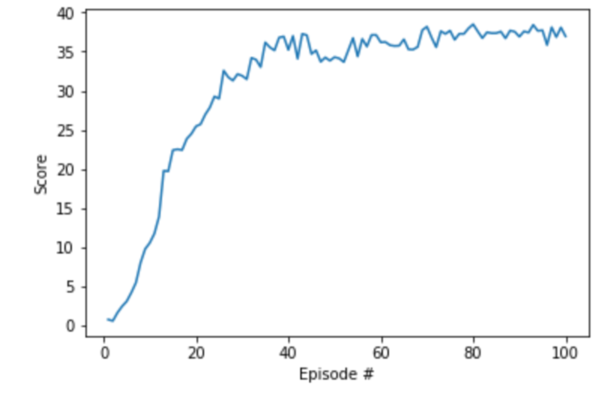

# Introduction
This report outines the implementation of a learning Agent to control a double-jointed arm to hold the agent's hand within a goal location (a sphere moving around a 3d space).

The Agent recieved a reward of +0.1 if the Agent's hand is in the goal location. The aim of the agent is to remain within goal location for as many timesteps as possible.

The Agent is assumed to have solved the environment if it achieves an average score of 30 or more over 100 episodes.

# Description of the Learning Algorithm
The Agent attempts to learn how to control the double-jointed arm to maximise the rewards in 

The Agent uses an implementation of the Determistic Deep Policy Gradient algorithm ([DDPG](https://arxiv.org/abs/1509.02971)) using the code provided in [Udacity Deep Reinforcement Learning - ddpg-pendulum](https://github.com/udacity/deep-reinforcement-learning/tree/master/ddpg-pendulum) as a basis for the implemented Agent.

DDPG uses two networks, an Actor and a Critic; 
 - the Actor attempts to learn the Policy to decide on the action to take based on the current environment state
 - the Critic attempts to learn Value function to estimate value of the action taken 

Both the Actor and Critic networks have a local and target network; during learning the local network is updated and after a period of time the target network is updated using a soft update.

The Algorithm implemented had the following configuration:

**Actor**
- 2 Hidden layers with 400 and 300 units using RELU activation
- Batch Normalisation
**Critic**
- 2 Hidden layers with 400 and 300 units using RELU activation
- Batch Normalisation
- Tanh activation function on output

**DDPG Algorithm**
- Learning Periodically rather than on every timestep
- Initialising the network weights for the local and target networks to the same value (for both Actor and Agent networks)

## Tuning the Agent
During the implementation of this Agent some experiements were performed to understand the effect of different parameters on the learning.

The aim was to redued the number of episodes required to solve the environment; other criteira could have been used but for the purpose of this project the reducing the number of episodes was the objective.

The time taken to train an Agent with a particular configuration to complete the environment was time-consuming so these investigations were performed using a more constrained version of the enviornment. The constrained version required the Agent to achieve an average score of 10 or more over 10 episodes with an upper limit of 50 episodes.

A baseline Agent was trained that had the following characteristics:

|Agent Characteristic|Property|
|---|---|---|
|Initial Hard Update| No|
|Network Size| 400 -> 300|
|Learning Frequency| Every 20 timesteps|
|Learning Steps| 10 learning steps each learning epoch|

This baseline agent solved the constrained environment within __28 eposides__.

Following this a series of experiements were performed where one parameter was altered at a time and the number of episodes to solve the constrainted envionrment was recored.

The following table shows the experiments and their results on the learning.

|Agent Characteristic|Property|Number of Episodes requred to solve|
|---|---|---|
|Initial Hard Update|Yes|27|
|Network Size| 256 -> 128|29|
|Network Size| 600 -> 400|45|
|Network Size| 1024 -> 512|36|
|Learning Frequency|Every 30 timesteps|32|
|Learning Frequency|Every 10 timesteps|20|
|Learning Steps|20 learning steps per learning epoch|22|
|Learning Steps|5 learning steps per learning epoch|39|

Based on these experiments the following was concluded:
 - Initialising the Target and Local Actor/Critic networks to the same values has some positive impact. However this was not as significant as was claimed by various people on the DRLND Slack channel
 - The Baseline Network Size appears to be reasonable
 - Increasing the frequency of learning and increasing the number of learning steps each time has a large impact

The led to a target configuration for the full training to be as follows:

|Agent Characteristic|Property|
|---|---|---|
|Initial Hard Update| Yes|
|Network Size| 400 -> 300|
|Learning Frequency| Every 10 timesteps|
|Learning Steps| 20 learning steps each learning epoch|

## Plot of Rewards
The selected Agent Characteristics was used to train an agent in the full game to achieve an average score of 30 over 100 episodes.

The Agent was able to solve the environment within 100 episodes.

The following plot shows the plot of rewards during the training:

The Agent seemed to gain proficiency within a small number of episodes and maintained this proficiency through out the learning.

While this can be considered as successful, the time taken to train this Agent was considerable. Mostl likely due to the incresed learning frequency and steps.

# Ideas for Future Work
During the implementation of this solution some tuning of the Agent and Learning paramters was performed however this was limited:
- Use of a hard-update when initialising the Agent
- The number of nodes in the hidden layers for Actor and Critic Networks
- Different schemes for learning such as the learning frequency and the number of learning iterations

Additional tuning could be performed along the lines of:
 - Different network structures for the Actor and Critic networks
 - Altering Learning rates for Actor and Critic

 The current implementation was tuned, to some degree, to reduce the number of episodes required to solve the environment. While this was achieved, it resulted in quite slow (in terms of time) episodes and therfore the overall time to learn and solve the environment. Further investigation could be conducted to find a better balance between the number of episodes needed and the time to complete episodes; for example tuning parameters to make episodes complete quicker but at the expense of needing more episodes.

Lastly, the current implementation solves the environment using DDPG; further work could be to implement a solution using a different algorithm such as Proximal Policy Optimisation ([PPO](https://arxiv.org/pdf/1707.06347.pdf))

